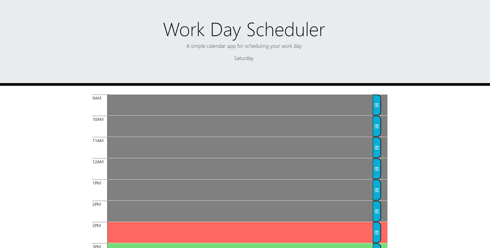

# Schedualer
This project creates a way to store potential to-do's and or events for a daily hour-hour schedual from 9-5. this would be very helpfull if you had a specific set of tasks to preform within this time span, you could set it up a day prior.

This project was created to creat a schedual to store data for a timed schedual

During the creation of this I learned how local storage works and operates within a browser and how you can use this to store and collect input for future use.

The usage is pretty simple, you simply click into a time box area and type the mesage you want it to remember then click the save icon on the right side of said textbox. This will save the content into the 'local storage' and will still be there upon reloading the page or even restarting the browser. The hour is shown by the highlighted textbox being red, hours that have passed will turn grey and ones that havent come yet remain green.

Deployed Link:
https://domomyles.github.io/Schedualee/

Screenshot:

